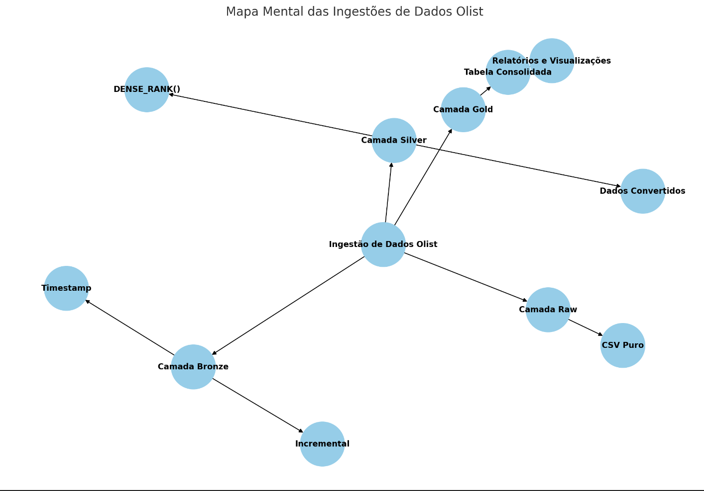

Projeto de Ingestão de Dados Olist

Os dados utilizados neste projeto são provenientes do Olist, uma plataforma de e-commerce que conecta vendedores e compradores. O Olist fornece dados sobre vendas, clientes, produtos e logística, abrangendo diversas informações relacionadas ao segmento de comércio eletrônico.

Segmento: E-commerce
Esse segmento inclui:

Vendas: Informações sobre transações, como produtos vendidos, valores, formas de pagamento e status dos pedidos.
Clientes: Dados sobre os consumidores, incluindo informações demográficas e de localização.
Logística: Informações relacionadas ao envio e entrega dos produtos, como prazos e rastreamento.

utilizamos Python e SQL para processar dados provenientes da base do Olist, organizando-os em diferentes camadas: Raw, Bronze, Silver e Gold.

Estrutura das Camadas
Camada Raw
A camada Raw consiste em arquivos CSV em seu estado bruto, sem qualquer modificação. A cada nova ingestão, os dados são sobrescritos, garantindo que sempre tenhamos a versão mais atualizada dos dados brutos.

Camada Bronze
Na camada Bronze, os dados são armazenados em formato Delta. Aqui, adicionamos uma coluna do tipo Timestamp, que registra a data da carga de dados. A ingestão nessa camada é feita de forma incremental, permitindo a atualização contínua dos dados.

Camada Silver
A camada Silver contém dados também em formato Delta. Nessa etapa, realizamos as devidas conversões necessárias para armazenar os dados no formato desejado. Os dados inseridos na camada Silver são sempre os mais recentes da camada Bronze, utilizando a função DENSE_RANK() para assegurar a correta classificação dos dados.

Camada Gold
A camada Gold é composta por uma tabela consolidada que reúne as informações da camada Silver. É através desta tabela que geramos relatórios e visualizações, facilitando a análise de dados.

Visualizações
Adicionalmente, desenvolvemos alguns gráficos que servem como exemplos de visualização de dados, permitindo uma melhor compreensão das informações extraídas e processadas.

Estrutura do Mapa Mental:
Ingestão de Dados Olist: O ponto de partida.
Camada Raw: Armazena os arquivos CSV puros.
CSV Puro: Dados brutos.
Camada Bronze: Inclui dados em formato Delta com a coluna de Timestamp.
Incremental: Ingestão contínua de dados.
Camada Silver: Dados convertidos para o formato desejado.
Dados Convertidos: Formatação e transformação dos dados.
DENSE_RANK(): Função utilizada para classificação.
Camada Gold: Tabela consolidada.
Tabela Consolidada: Integra todos os dados processados.
Relatórios e Visualizações: Saídas analíticas baseadas nos dados.